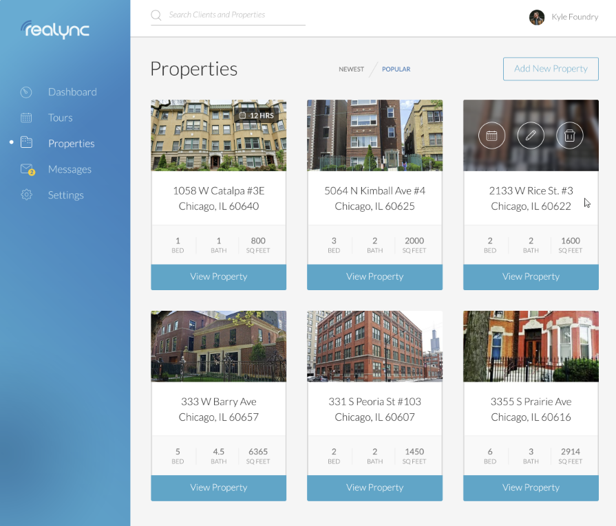
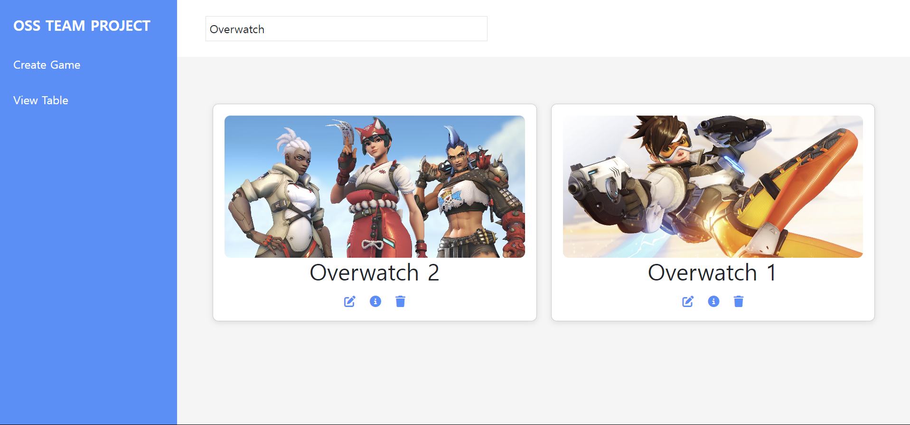

# 2024-2 오픈소스 스튜디오 팀 프로젝트

### Simple Service App with React & Open API

Link -> https://mins-oss-team-project.netlify.app/

민경빈 (22300265) & 민태홍 (22300266)

프로젝트 목적: 다양한 플랫폼의 게임 정보를 관리하는 것  
대상: 게임을 즐기는 누구나, 여러 플랫폼의 게임을 한 번에 관리하고자 하는 유저  
관리 데이터 항목: 게임 이름, 장르, 제작사, 출시연도, 플랫폼, 평점, 가격, 설명, 게임모드, 지원언어, 연령등급, 다운로드 크기, 시스템 요구 사항 DLC여부 (총 14가지)  
기능:
<ol>
<li>RAWG API를 이용해 게임 이미지를 불러와 카드 형식으로 시각화 기능</li>
<li>사용자가 직접 게임정보들을 다룰 수 있는 CRUD 기능</li>
<li>게임 이름을 검색하여 찾을 수 있는 검색 기능</li>
<li>출시연도, 평점, 가격 등 다양한 기준으로 sorting 할 수 있는 정렬 기능</li>
<li>카드 형식의 시각화가 아닌 일반적인 표 형식으로도 사용자에게 제공하는 기능</li>
</ol>
비슷한 서비스 사례: Steam, Epic Games, GOG Galaxy
  
기술스택:
<ol>
<li>mockAPI를 사용해 데이터를 JSON 형식으로 관리
<li>React-Bootstrap UI Library를 통해 사용자 인터페이스를 구성
<li>React Hook Form을 사용하여 폼 처리 및 유효성 검사를 수행
<li>Axios를 통해 비동기 통신을 구현
<li>FontAwesome Icon Library를 사용하여 아이콘을 추가
<li>RAWG Open API를 활용하여 게임 데이터를 가져옴
</ol>
 
레이아웃 예시: 
 
 
예상 화면: 
 
 
앞으로 개선 하고 싶은 기능:
<ol>
<li>전체적인 페이지의 스타일 개선</li>
<li>다양한 디스플레이에서 페이지가 호환될 수 있도록 개선</li>
<li>다른 Open API를 활용하여 특정 게임의 인기가 높은 지역을 지도 형식으로 시각화하여 보여주는 기능</li>
</ol>

npm install react-router-dom 
npm install axios 
 npm install @mui/material @emotion/react @emotion/styled @mui/icons-material 
# Getting Started with Create React App

This project was bootstrapped with [Create React App](https://github.com/facebook/create-react-app).

## Available Scripts

In the project directory, you can run:

### `npm start`

Runs the app in the development mode.\
Open [http://localhost:3000](http://localhost:3000) to view it in your browser.

The page will reload when you make changes.\
You may also see any lint errors in the console.

### `npm test`

Launches the test runner in the interactive watch mode.\
See the section about [running tests](https://facebook.github.io/create-react-app/docs/running-tests) for more information.

### `npm run build`

Builds the app for production to the `build` folder.\
It correctly bundles React in production mode and optimizes the build for the best performance.

The build is minified and the filenames include the hashes.\
Your app is ready to be deployed!

See the section about [deployment](https://facebook.github.io/create-react-app/docs/deployment) for more information.

### `npm run eject`

**Note: this is a one-way operation. Once you `eject`, you can't go back!**

If you aren't satisfied with the build tool and configuration choices, you can `eject` at any time. This command will remove the single build dependency from your project.

Instead, it will copy all the configuration files and the transitive dependencies (webpack, Babel, ESLint, etc) right into your project so you have full control over them. All of the commands except `eject` will still work, but they will point to the copied scripts so you can tweak them. At this point you're on your own.

You don't have to ever use `eject`. The curated feature set is suitable for small and middle deployments, and you shouldn't feel obligated to use this feature. However we understand that this tool wouldn't be useful if you couldn't customize it when you are ready for it.

## Learn More

You can learn more in the [Create React App documentation](https://facebook.github.io/create-react-app/docs/getting-started).

To learn React, check out the [React documentation](https://reactjs.org/).

### Code Splitting

This section has moved here: [https://facebook.github.io/create-react-app/docs/code-splitting](https://facebook.github.io/create-react-app/docs/code-splitting)

### Analyzing the Bundle Size

This section has moved here: [https://facebook.github.io/create-react-app/docs/analyzing-the-bundle-size](https://facebook.github.io/create-react-app/docs/analyzing-the-bundle-size)

### Making a Progressive Web App

This section has moved here: [https://facebook.github.io/create-react-app/docs/making-a-progressive-web-app](https://facebook.github.io/create-react-app/docs/making-a-progressive-web-app)

### Advanced Configuration

This section has moved here: [https://facebook.github.io/create-react-app/docs/advanced-configuration](https://facebook.github.io/create-react-app/docs/advanced-configuration)

### Deployment

This section has moved here: [https://facebook.github.io/create-react-app/docs/deployment](https://facebook.github.io/create-react-app/docs/deployment)

### `npm run build` fails to minify

This section has moved here: [https://facebook.github.io/create-react-app/docs/troubleshooting#npm-run-build-fails-to-minify](https://facebook.github.io/create-react-app/docs/troubleshooting#npm-run-build-fails-to-minify)

